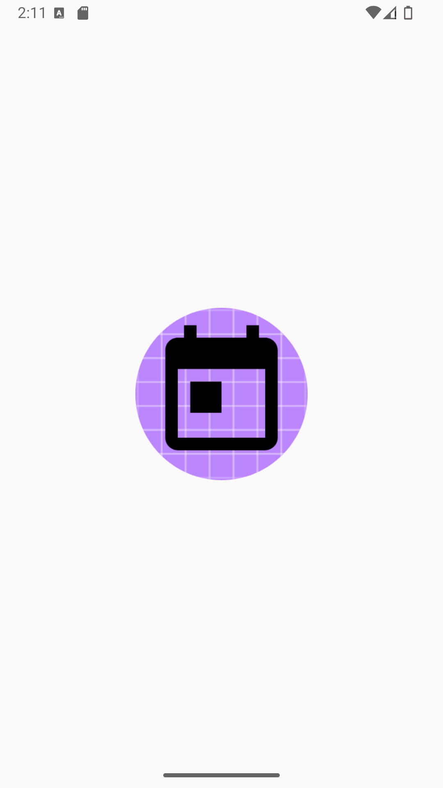
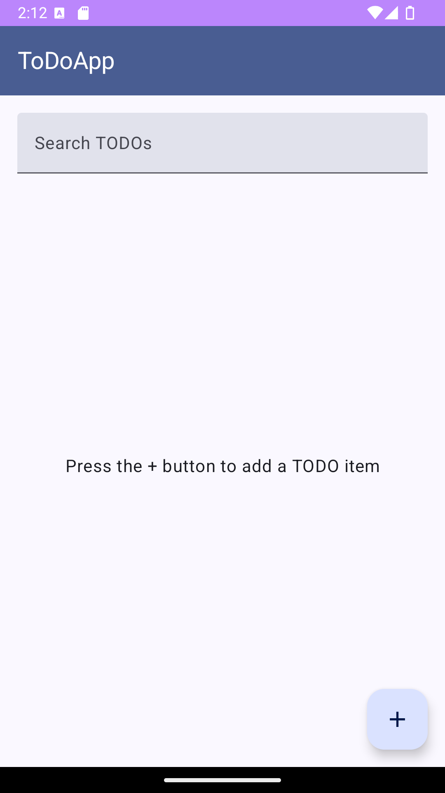
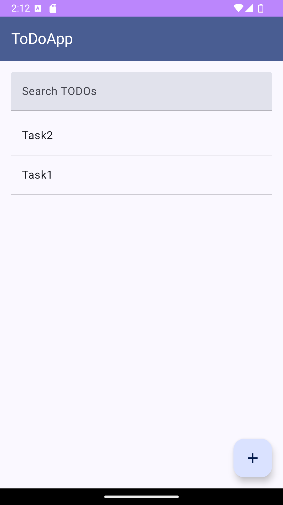

# ToDo App

A modern ToDo application built with Jetpack Compose, Hilt for dependency injection, and Room for local database persistence. This app helps users manage their tasks efficiently with a clean and intuitive interface.

## Features

- **Add New ToDos**: Easily add new tasks to your list.
- **Search Functionality**: Quickly find tasks using a search bar.
- **Material Design UI**: Sleek, responsive design with Material Design 3 components.
- **Error Handling**: Display error messages via Snackbar.
- **Loading Indicators**: Show progress while tasks are being processed.

## Libraries Used

- **Jetpack Compose**: For building modern UI components.
- **Hilt**: Dependency injection library.
- **Navigation Component**: Manages navigation between screens.
- **Kotlin Coroutines**: Handles asynchronous operations.
- **Room**: Local database management.
- **Material Design Components**: Ensures a consistent UI.

## Getting Started

To get this app running locally, follow these steps:

### Prerequisites

- **Android Studio Arctic Fox** or later
- **JDK 11** or later
- **Kotlin 1.5** or later

### Setup

  **Clone the Repository**
  
   git clone https://github.com/your-username/todo-app.git

